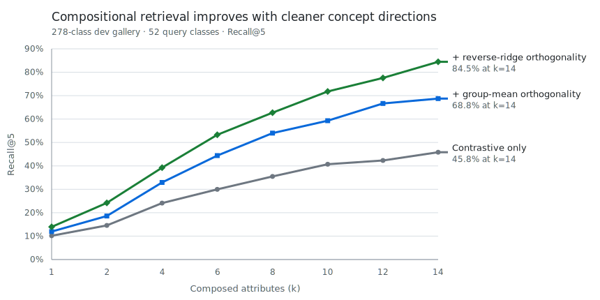

# ConceptBasis

**[Live playground](https://markjouh.github.io/conceptbasis/)**

ConceptBasis learns an image–text embedding organized around a dictionary of
human-readable concepts. Each concept is represented by a direction in the
embedding space, so images can be described by concept activations and queries
can be edited through **sliders you can search with**.

The project has three main parts:

1. A pipeline for constructing a concept dictionary and labeling training
   images against it with a local vision-language model.
2. A reverse-ridge estimator that recovers each concept's partial embedding
   effect while controlling for the other dictionary labels.
3. An orthogonality loss that pushes those partial effects toward a useful
   basis while preserving ordinary image–text retrieval behavior.

The active development objective is standard symmetric image–text contrastive
loss plus pairwise overlap among reverse-ridge directions. It alternates
minibatch contrastive updates with one exact full-training-set reverse-ridge
update per epoch. Marginal group means remain a baseline, not the direction
definition used by the active model.

In the ideal linear picture, orthogonal concept directions are independently
decodable and can be added without one component overwriting another. Real
semantic concepts are neither independent nor perfectly orthogonal, so we do
not force that ideal. The goal is to recover some of its useful behavior while
retaining a strong general-purpose embedding.

## Evidence from additive retrieval

Adding concept directions provides a direct behavioral test of the geometry:
does each added concept preserve useful information? The model is never trained
on this retrieval task. On classes excluded from dictionary construction and
adapter training, pure reverse-ridge orthogonality raises Recall@5 from 73.0%
to 84.5% over a matched contrastive-only adapter at 14 concepts. Ordinary
image–text Recall@5 remains essentially unchanged (89.1% versus 89.7%; the
latter is the legacy first-2,000-example sweep diagnostic).



This development benchmark retrieves 52 eligible query classes against the
278-class development gallery, with 24 nested attribute-subset rollouts per
query and identical queries across models. It is evidence on classes unseen
during training, not the sealed final test. Full metrics and provenance are in
[`research/experiments/2026-07-11-reverse-ridge-basis-adapter.md`](research/experiments/2026-07-11-reverse-ridge-basis-adapter.md),
with compact tracked metrics in
[`research/results/reverse_ridge_dev_results.json`](research/results/reverse_ridge_dev_results.json).

## Pipeline

| Stage | Entry point |
|---|---|
| Freeze class-level train/dev/test partitions | `scripts/data/make_class_splits.py` |
| Mine image attributes and captions | `scripts/data/` |
| Label train images against the frozen dictionary | [`scripts/data/label_dictionary_concepts.py`](scripts/data/label_dictionary_concepts.py) ([model-selection record](research/experiments/2026-07-11-local-vlm-dictionary-labeling.md)) |
| Construct the 256-concept dictionary | `scripts/dictionary/build_dictionary.py` |
| Build and verify concept directions | `scripts/dictionary/` |
| Train the selected reverse-ridge adapter | `python -m conceptbasis.train --objective reverse-ridge` |
| Reproduce the incremental baselines | `python -m conceptbasis.train --objective {contrastive,group-mean,reverse-ridge}` |
| Evaluate basis behavior and additive retrieval | `scripts/evaluation/` |
| Generate playgrounds and galleries | `scripts/visualization/` |

The dictionary is constructed only from train-class CC0 images and is then held
fixed for unseen development and test classes. The selected reverse-ridge
configuration is recorded in the experiment note above; `reproduce.sh`
reproduces all three incremental objectives under the same training entry point.

## Evaluation protocol

The 1,854 THINGS object classes are split once at the class level: 1,298 train,
278 development, and 278 test. Every full-set image and its corresponding CC0
representative inherit the same class split.

- Train classes may be used for tags, dictionary construction, direction
  estimation, calibration, and adapter training.
- Development classes may be used for direction-recipe selection,
  hyperparameters, case studies, and the public CC0 playground.
- Test classes require an explicit `--allow-test` flag and are reserved for the
  final confirmatory evaluation.

The manifest is tracked in `data/splits.json`; test annotations remain under an
ignored `data/heldout/` directory.

## Repository layout

- `conceptbasis/` — model, loss, and training implementation.
- `scripts/` — data, dictionary, evaluation, sweep, and visualization CLIs.
- `research/` — experiment notes, compact results, and artifact provenance.
- `docs/` — static public playground and inspection galleries.
- `data/` — tracked annotations plus ignored regenerable arrays.
- `outputs/` — ignored checkpoints and local generated artifacts.

## Setup

```bash
pip install -e '.[dev]'
./reproduce.sh
python -m pytest -q
```

Python 3.10 or newer is required. Attribute mining, captioning, and concept
verification use an OpenAI-compatible local VLM endpoint configured with
`VLM_API_URL` and `VLM_MODEL`.

THINGS images are not redistributed. The public demos use the freely licensed
THINGSplus CC0 subset; the full THINGS dataset remains subject to its original
research license.
